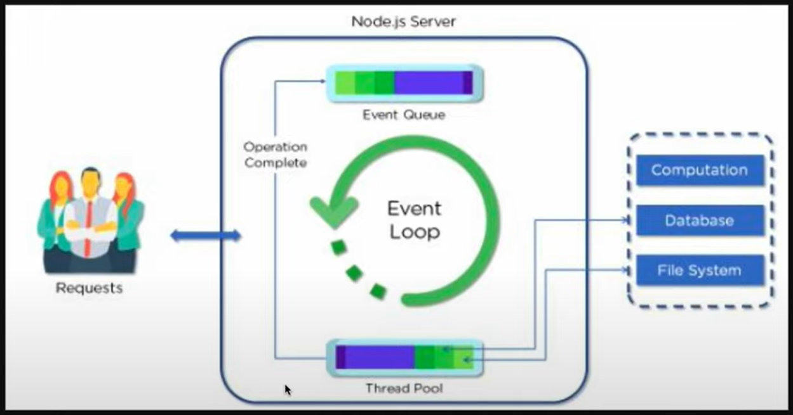
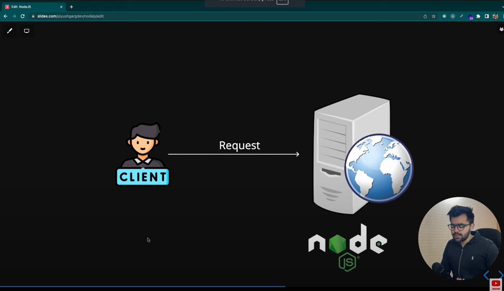
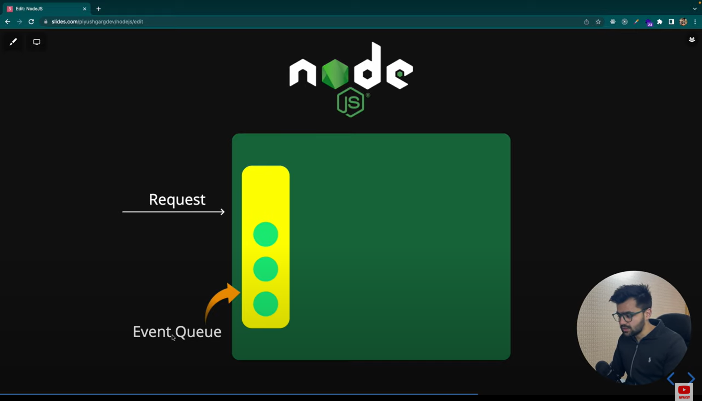
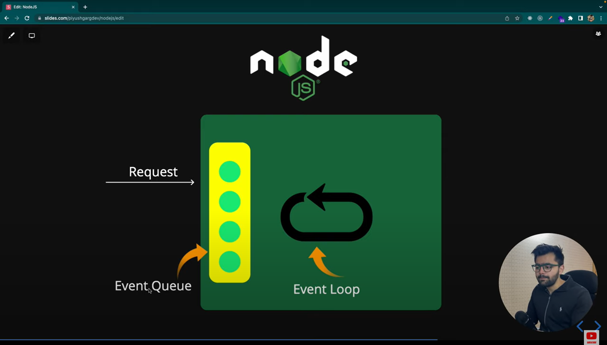
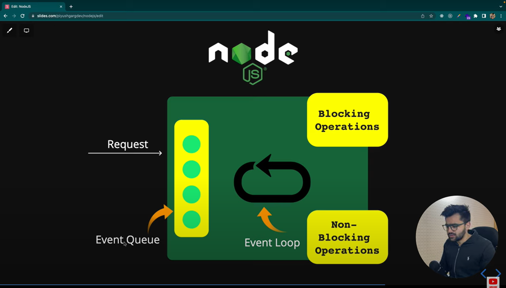
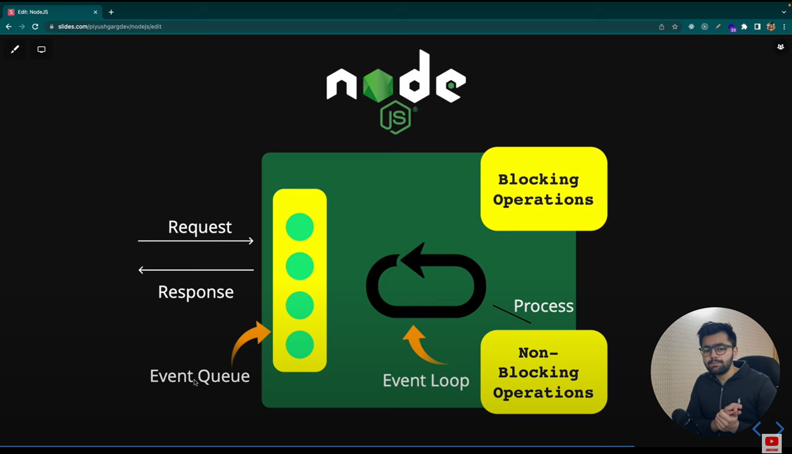
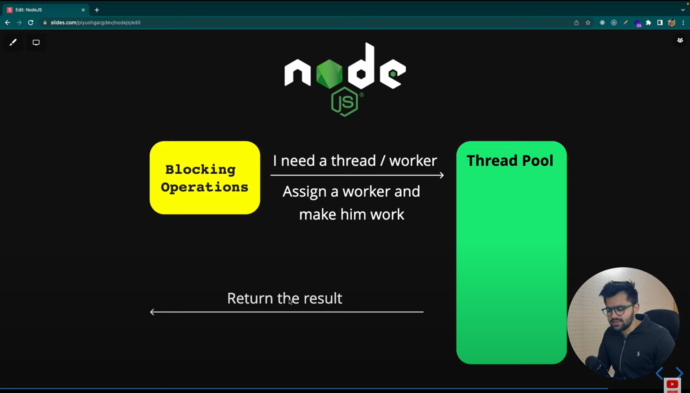
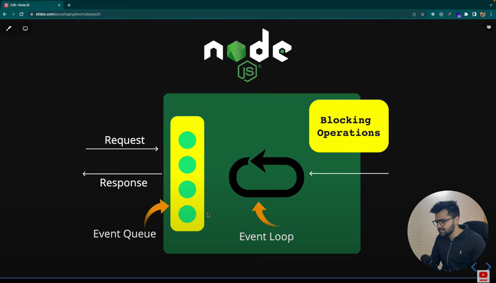

# Node.js Architecture

### Flow of Node Js starts with a client

### Client send a request to the server

### Those requests will be queued up in Event Queue 

### All the requests in Event Queue will be watched and picked up by Event Loop 

### The requests picked from the Event Queue can be of two types :
    1) Blocking Operations (Synchronous)
    2) Non-Blocking Operations (Asynchronous)

### If the request is of Non-Blocking type, the request will be resolved and the response will be sent to the user.

### If the request is of Blocking type, In-order to resolve the request, the request will be forwarded to a thread pool(Pool which contains multiple threads).

__NOTE :__ By default the thread pool consists of 4 threads.

The number of threads can be increased depending on the number of cores and CPU's present on your machine.  

### When that particular thread completes the task, it returns the result and gets back to the thread pool.

__NOTE :__ It's always advised to use non-blocking operations i.e Asynchronous operations than using the blocking operations i.e Synchronous operation, because of the scalability issues