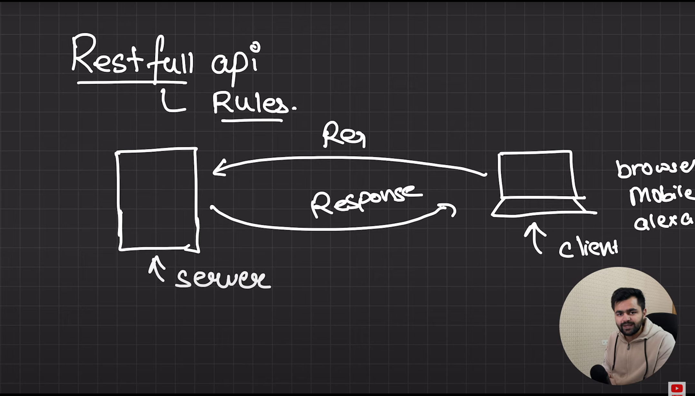

# REST API or RESTful API

    A RESTful API (Representational State Transfer) is a type of web service or API (Application Programming Interface) that follows the principles of REST architecture. REST is an architectural style that uses standard HTTP methods to interact with resources (data) on a server.

#### The client(Req) and server(Res) while communicating with each other need to follow some rules and best practices. These rukes are called REST Api

## REST API rules :

### 1) Resources
    In REST, everything is treated as a resource, which can be a piece of data or an object, such as a user, order, or product. Each resource is identified by a URL (Uniform Resource Locator).

### 2) HTTP Methods

REST APIs use standard HTTP methods to perform operations on resources:

 - GET: Retrieve data from the server.

 - POST: Create a new resource on the server.

 - PUT: Update an existing resource on the server.

 - DELETE: Remove a resource from the server.

 - PATCH: Partially update a resource.

### 3) Stateless
    REST APIs are stateless, meaning each request from the client to the server must contain all the information needed to process it. The server does not store any session information between requests.

### 4) URI (Uniform Resource Identifier)
    A REST API identifies resources using URIs (such as /users/123 for a specific user) that uniquely define a particular resource.

### 5) JSON (JavaScript Object Notation) or XML
    REST APIs commonly return data in formats like JSON or XML, with JSON being the more popular format because of its simplicity and ease of integration with JavaScript-based applications.

### 6) Client-Server Separation
    In REST, the client and server are separated, meaning the client only knows the URIs of resources, and the server manages the data. This allows for flexibility in how the frontend and backend communicate.

### Example REST API Calls

 - GET /users: Retrieve a list of users.

 - POST /users: Create a new user.

 - GET /users/{id}: Retrieve a specific user by their ID.

 - PUT /users/{id}: Update the details of a specific user.

 - DELETE /users/{id}: Remove a specific user.

## Benefits of REST APIs

 - `Scalability`: Separation of client and server allows the system to scale independently.

 - `Simplicity`: REST APIs use standard HTTP methods, making them easier to use and understand.

 - `Performance`: REST can leverage caching to improve performance.

### Acronyms
1) `SSR` : Server Side Rendering.

2) `CSR` : Client Side Rendering.