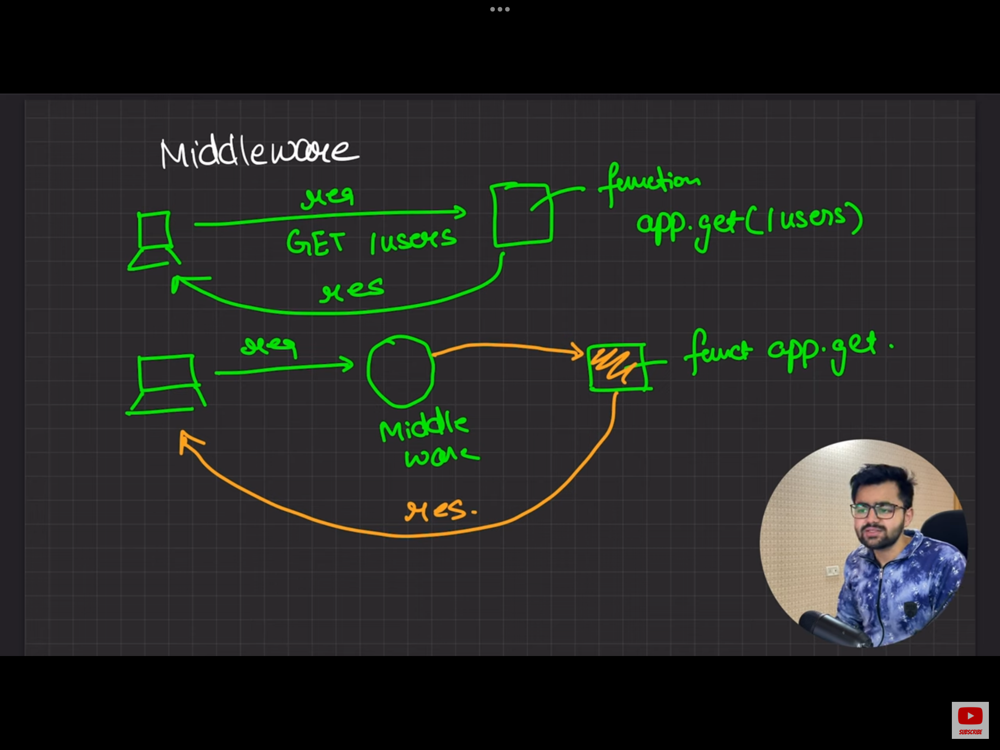
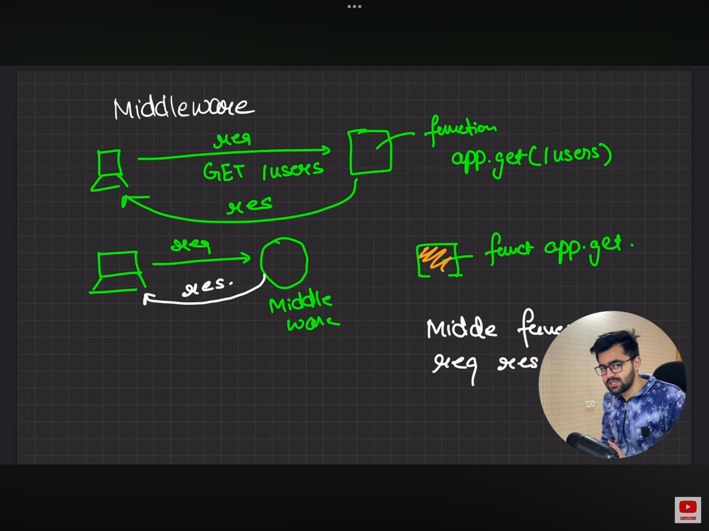
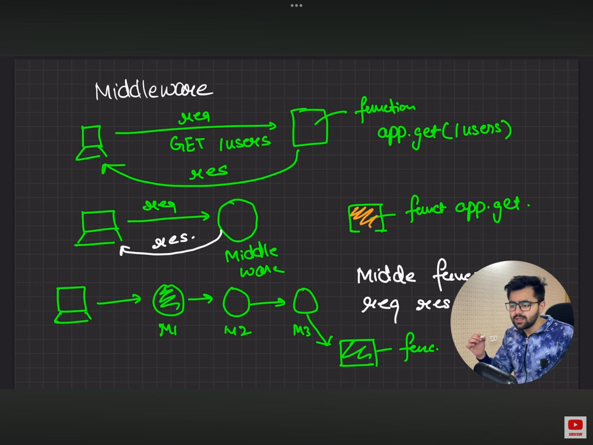

# Middlewares in Express.js

    Middleware functions are functions that have access to the request object (req), the response object (res), and the next middleware function in the application’s request-response cycle. The next middleware function is commonly denoted by a variable named next.

    Definition : GFG :

    Middleware is a request handler that allows you to intercept and manipulate requests and responses before they reach route handlers. They are the functions that are invoked by the Express.js routing layer.

### Middleware functions can perform the following tasks:

 - Execute any code.

 - Make changes to the request and the response objects.

 - End the request-response cycle.

 - Call the next middleware function in the stack.

### Syntax:
```javascript
app.get(path, (req, res, next) => {}, (req, res) => {})
```

### Types of Middleware

 - __Application-level middleware:__ Bound to the entire application using app.use() or app.METHOD() and executes for all routes.

 - __Router-level middleware:__ Associated with specific routes using router.use() or router.METHOD() and executes for routes defined within that router.

 - __Error-handling middleware:__ Handles errors during the request-response cycle. Defined with four parameters (err, req, res, next). Usually defined at the end.

 - __Built-in middleware:__ Provided by Express (e.g., express.static, express.json, etc.).

 - __Third-party middleware:__ Developed by external packages (e.g., body-parser, morgan, etc.).

 

 

 