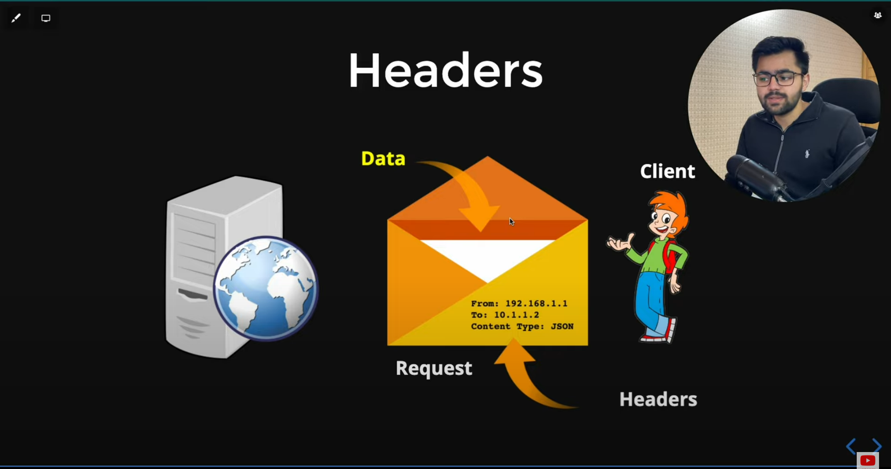
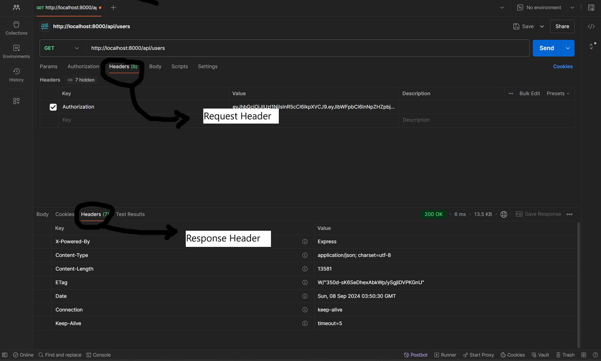

# HTTP Headers in API

    HTTP headers let the client and the server pass additional information with an HTTP request or response. 
    
    An HTTP header consists of its case-insensitive name followed by a colon ( : ), then by its value. Whitespace before the value is ignored.

### Understanding the HTTP headers through a story :

    HTTP Headers are an important part of the API request and response as they represent the meta-data associated with the API request and response.

    Headers carry the information for the request and response body.

    meta-data : Data about data

### Headers in Postman

__NOTE :__ We also have access to the response header and we can set our own custom header.
We set the headers in Key-Value pair while we send the request.

### Good practices while dealing with the headers

1) Always add X to custom headers.

### To know more about custom and built-in header : 
https://flaviocopes.com/http-request-headers/