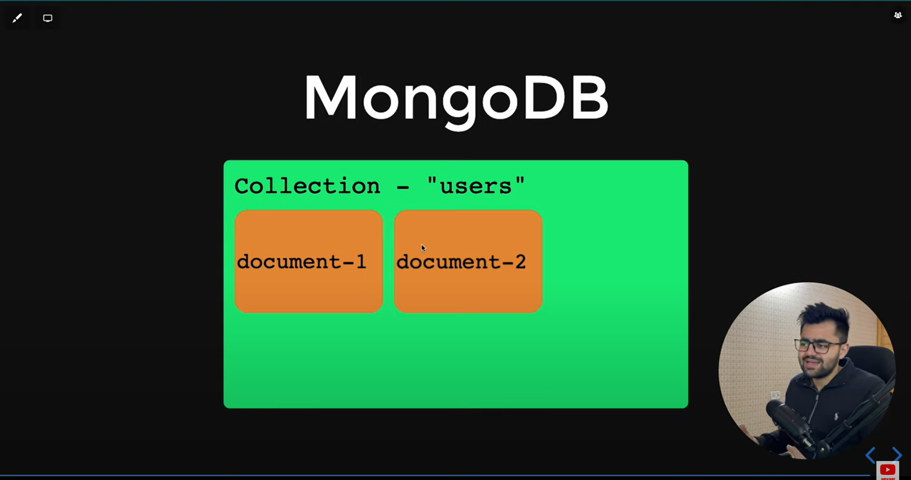
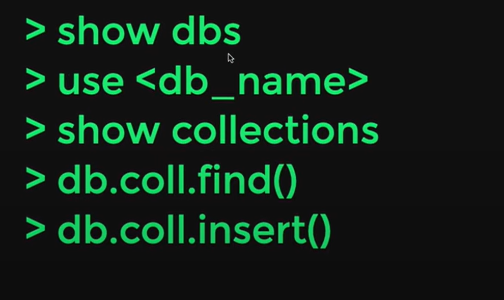

# MongoDB

1) No-SQL Document based Database.

2) Strong support for aggregation pipes.

3) Works on BSON format.

4) Best for Node applications.

### MongoDB Architecture : 

### MongoDB basic commands : 
