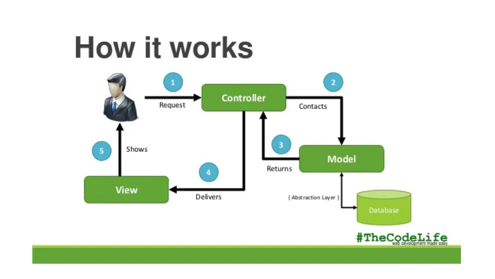
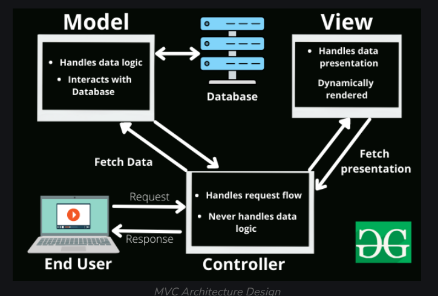
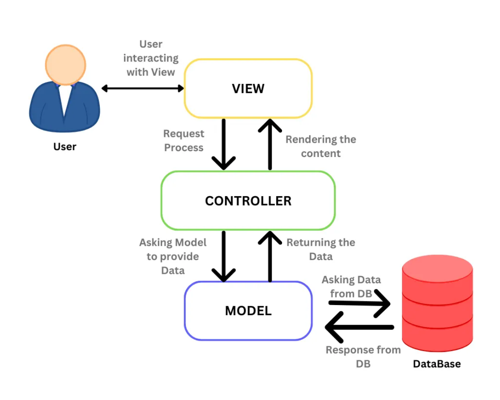

# Model-View-Controller

### Overview :
    Over the last few years, websites have shifted from simple HTML pages with a bit of CSS to incredibly complex applications with thousands of developers working on them at the same time. 
    
    To work with these complex web applications developers use different design patterns to lay out their projects, to make the code less complex and easier to work with. 
    
    The most popular of these patterns is MVC also known as Model View Controller.

### Model-View-Controller (MVC) is a software design pattern that separates an application's user interface, data, and logic into three parts:

#### Model : 
    Represents the application's state and business logic. For example, a model object could represent a character in a game or a contact in an address book.

### View : 
    Presents the application's content to the user through the user interface. View objects can respond to user actions and know how to draw themselves.

### Controller :
    Acts as an intermediary between the model and view objects. The controller handles user interaction, works with the model, and selects a view to render.

__NOTE :__ The MVC pattern helps to achieve separation of concerns, which improves the division of labor and separates the application's business logic from its display.

### Images explaining MVC Architecture : 

